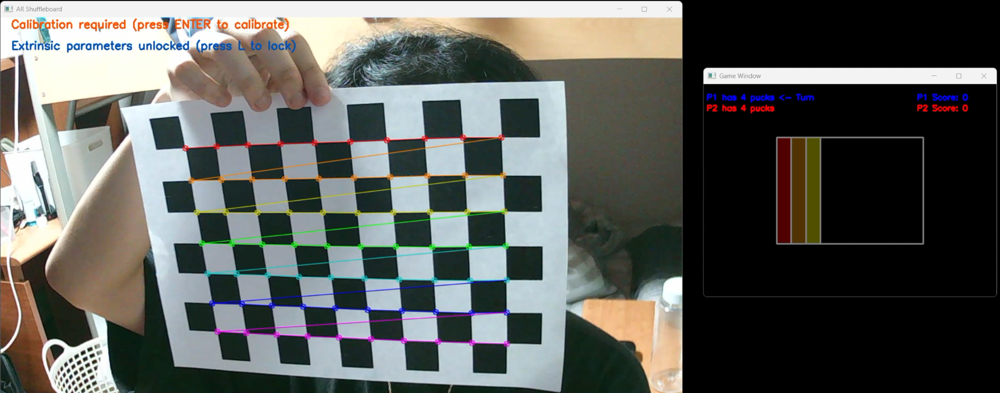
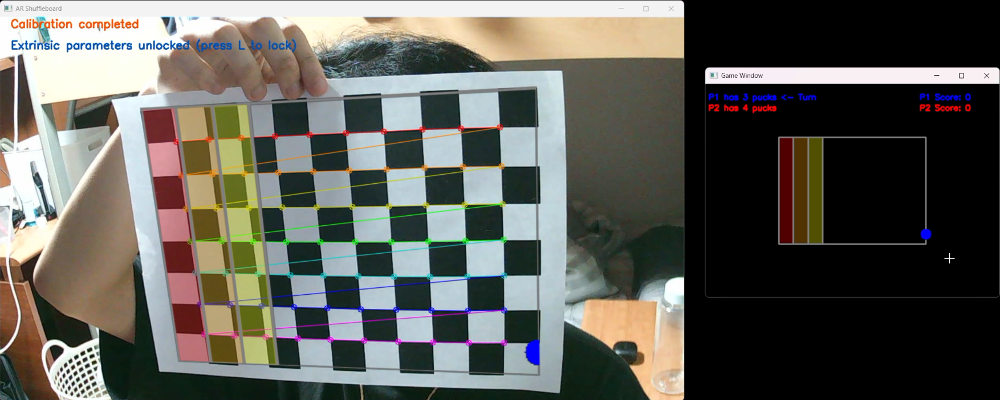
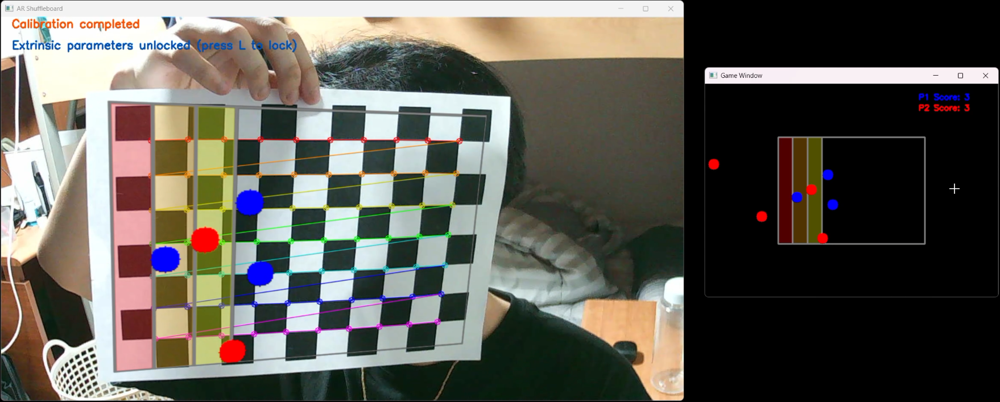
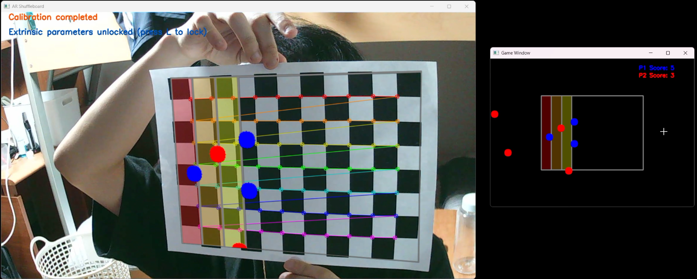

# seoultech-computervision-ar-shuffleboard

컴퓨터비전 텀 프로젝트: AR로 구현한 Shuffleboard 게임

## 프로젝트 개요

웹캠 영상 위에 Shuffleboard 게임을 증강현실(AR)로 구현하여 상호작용하는 프로젝트입니다.

- Python 버전: `>=3.11, <3.13`
- 주요 기술: `OpenCV`, `MediaPipe`
- 패키지/실행 관리: `uv`

## 데모

> TODO: 데모 이미지/동영상 추가

## 프로젝트 구조

```text
.
├─ pyproject.toml
├─ README.md
└─ src/
    └─ ar_shuffleboard/
        ├─ main.py
        ├─ controllers/
        ├─ models/
        └─ views/
```

## 요구 사항

1. `Python 3.8 이상` 버전 설치
2. `uv` 설치

    ```bash
    pip install uv
    ```

## 빠른 시작

프로젝트 루트에서 실행합니다.

1) 의존성 설치 및 가상환경 동기화

    ```bash
    uv sync
    ```

2) 앱 실행

    ```bash
    uv run app
    ```

## 설정

필요 시 아래 항목을 프로젝트에 맞게 수정하세요.

- `scr/ar_shuffleboard/config/config.cfg` 파일 내 값 수정 가능

    ``` cfg
    [window]
    title = AR Shuffleboard

    [video]
    width = 1280
    height = 720
    fps = 30
    mirror = true

    [chessboard]
    width = 10
    height = 7
    cell_size = 25
    ```

## 실행 방법

1. config.cfg 값 설정 및 체스보드 이미지 인쇄
2. 화면에 체스보드가 보이도록 배치하고 ENTER키를 눌러 카메라 캘리브레이션 수행 (내부 파라미터 고정)
    - 만약 체스보드와 카메라가 고정되어있다면, L/l 키를 눌러 외부 파라미터 또한 고정 가능 (한 번더 누르면 off)
3. 게임 화면에서 마우스 좌클릭을 통해 시작 선에 퍽을 배치한다.
4. 퍽이 배치된 상태에서 마우스 우클릭을 하여 반대 방향으로 퍽을 날린다. (힘은 거리에 비례)
5. 자동으로 다음 플레이어가 되며 위 3-4 방법을 모든 플레이어의 퍽을 소모할 때까지 반복한다.
6. 모든 플레이어의 퍽을 사용하면 게임이 종료되며, 마지막의 각 플레이어의 점수를 통해 게임의 승패를 결정한다.

### 실행 결과

1. 체스보드 준비 및 화면에 잘 보이도록 설정
    
2. ENTER키를 눌러 카메라 캘리브레이션 수행하여 게임 보드 투영
    
3. 게임 윈도우에서 마우스 클릭으로 게임 진행
    
    
4. 게임이 완료되면 점수를 통해 승패를 확인
    

### 특징

- 체스보드가 움직여도 실시간으로 외부 파라미터를 추출하여 게임 보드 이미지를 정확히 투영한다. 특히 게임 보드 경계선, 점수 영역, 퍽들을 게임 이미지에 그린 후 투영하여 체스보드에서도 게임 진행을 파악 가능하다.
- 준비된 퍽과의 거리에 비례하여 힘을 주어 퍽을 이동시킨다. 이동하는 퍽의 실시간 위치를 통해 각 플레이어의 점수를 실시간으로 업데이트한다.
- 게임 상태를 사용하여 퍽을 배치하고 치기 전까지 다음 플레이어로 넘어가지 않는다.